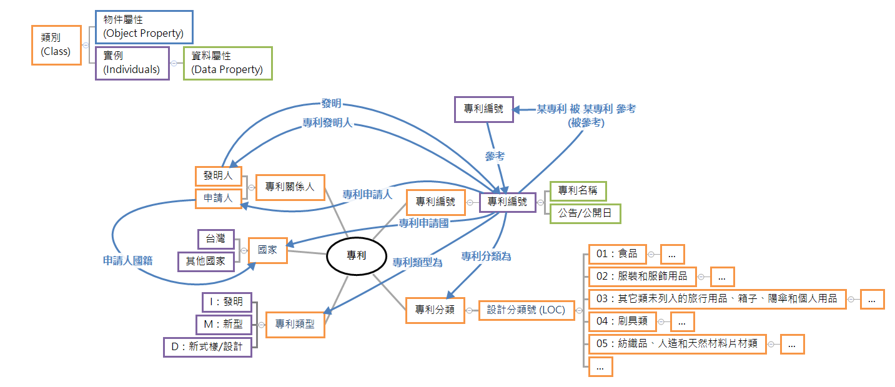
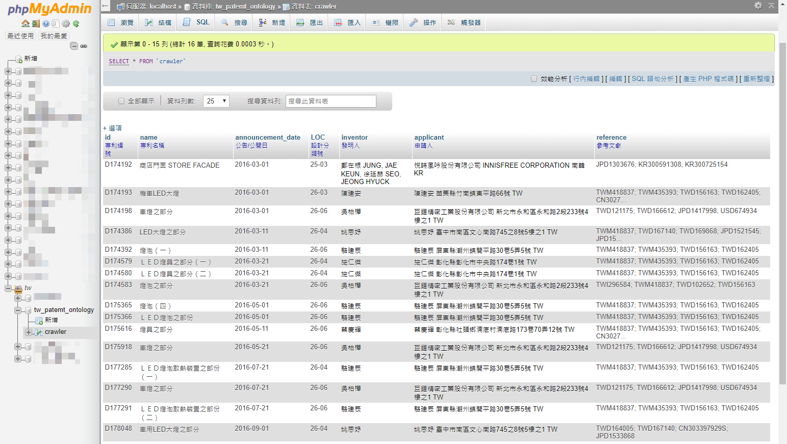
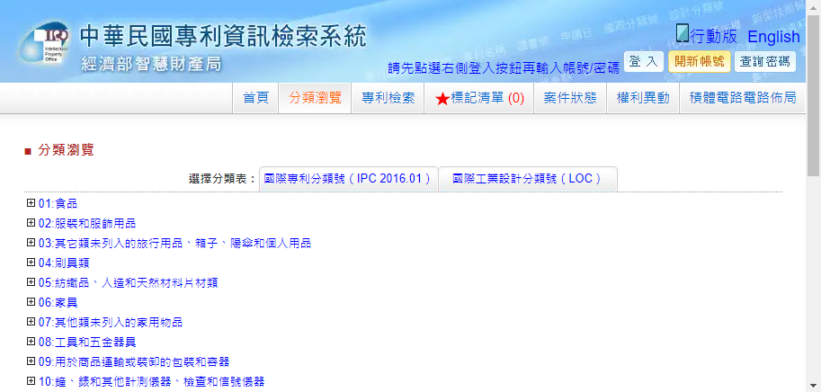
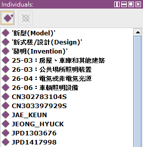
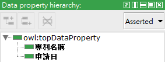
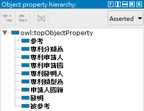
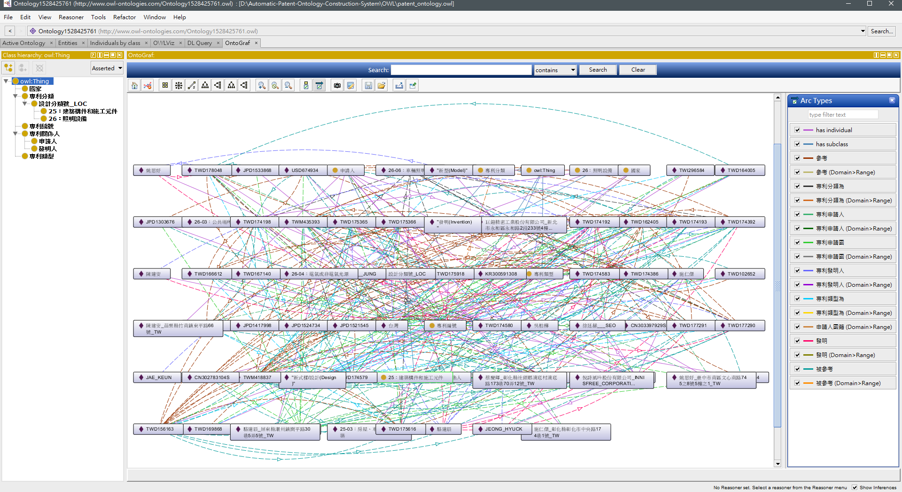
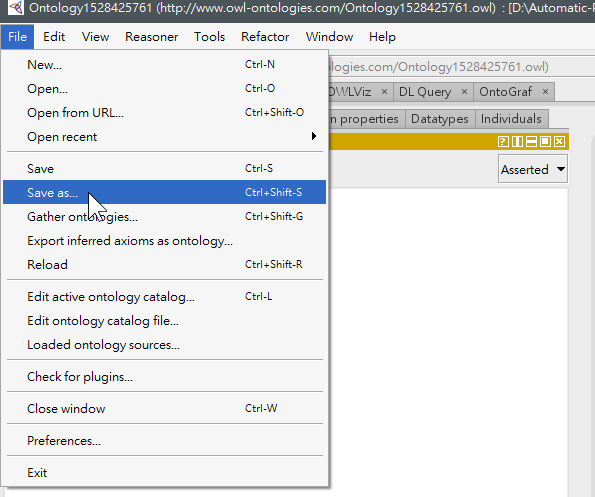
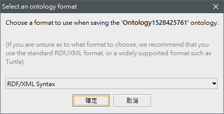

# Automatic Patent Ontology Construction System
專利本體論自動建置系統

## 開發環境
- Ruby (爬蟲)
- Java
    - Protege API：建置本體
    - Jena API：SPARQL 語法查詢本體知識
- MySQL
- Protégé


## 本體架構



---

## 專利資料
下圖是利用爬蟲至 [中華民國專利資訊檢索系統 的 分類瀏覽](http://twpat4.tipo.gov.tw/tipotwoc/tipotwkm) 頁面取得的專利資料，儲存在 MySQL DB，有以下欄位：

- `id`：專利編號
- `name`：專利名稱
- `announcement_date`：公告/公開日
- `LOC`：設計分類號
- `inventor`：發明人
- `applicant`：申請人
- `reference`：'參考文獻



---

## 自動建置專利本體論

程式運作流程：

- [`OntologyConstructor`](https://github.com/titangene/Automatic-Patent-Ontology-Construction-System/blob/master/src/ontology/OntologyConstructor.java)
    - `main()`：建置本體主要執行的程式
        - [`CategoryLocProcess.loadJson()`](https://github.com/titangene/Automatic-Patent-Ontology-Construction-System/blob/master/src/ontology/CategoryLocProcess.java#L38)：讀取 專利分類 LOC JSON 資料
        - [`CategoryLocProcess.parseJSON()`](https://github.com/titangene/Automatic-Patent-Ontology-Construction-System/blob/master/src/ontology/CategoryLocProcess.java#L42)：解析 專利分類 LOC JSON 資料，並建立分類資料
        - [`patentOWL.initOWL()`](https://github.com/titangene/Automatic-Patent-Ontology-Construction-System/blob/master/src/ontology/PatentOWL.java#L33)：初始化本體
        - [`patentOWL.saveOWL()`](https://github.com/titangene/Automatic-Patent-Ontology-Construction-System/blob/master/src/ontology/PatentOWL.java#L179)：將 本體 存成 OWL 檔

### [CategoryLocProcess.loadJson()](https://github.com/titangene/Automatic-Patent-Ontology-Construction-System/blob/master/src/ontology/CategoryLocProcess.java#L38)：讀取 專利分類 LOC JSON 資料

```java
public static void loadJson() {
    jsonData = readFile("./data/LOC_Category.json");
}
```

要讀取 專利分類 LOC 的 JSON 資料 ( `./data/LOC_Category.json` )，是因為每筆由爬蟲抓來的專利資料的專利分類分是數字代號 (例如： `26-03` )，而這些代號都有各至的分類說明，可以至 [中華民國專利資訊檢索系統 的 分類瀏覽](http://twpat4.tipo.gov.tw/tipotwoc/tipotwkm) 頁面取得。



此 JSON 資料也是由爬蟲取得的，為何專利分類的資料量這麼小？這是因為在此範例中的專利只用到這些專利分類。

```json
[
  {
    "id": "25",
    "name": "建築構件和施工元件",
    "subCategory": [
      {"id": "03", "name": "房屋、車庫和其他建築"}
    ]
  },
  {
    "id": "26",
    "name": "照明設備",
    "subCategory": [
      {"id": "03", "name": "公共場所照明裝置"},
      {"id": "04", "name": "電氣或非電氣光源"},
      {"id": "06", "name": "車輛照明設備"}
    ]
  }
]
```

### [CategoryLocProcess.parseJSON()](https://github.com/titangene/Automatic-Patent-Ontology-Construction-System/blob/master/src/ontology/CategoryLocProcess.java#L42)：解析 專利分類 LOC JSON 資料，並建立分類資料
解析 專利分類 LOC 的 JSON 資料 ( `./data/LOC_Category.json` )

### [patentOWL.initOWL()](https://github.com/titangene/Automatic-Patent-Ontology-Construction-System/blob/master/src/ontology/PatentOWL.java#L33)：初始化本體 (根據之前設計的本體架構建置)
- [`createOntClass()`](https://github.com/titangene/Automatic-Patent-Ontology-Construction-System/blob/master/src/ontology/PatentOWL.java#L49)：建立本體類別
- [`createOntIndividual()`](https://github.com/titangene/Automatic-Patent-Ontology-Construction-System/blob/master/src/ontology/PatentOWL.java#L70)：在剛剛建立的本體類別下建立本體實例
- [`createOntDataProperty()`](https://github.com/titangene/Automatic-Patent-Ontology-Construction-System/blob/master/src/ontology/PatentOWL.java#L82)：建立本體資料屬性
- [`createOntObjectProperty()`](https://github.com/titangene/Automatic-Patent-Ontology-Construction-System/blob/master/src/ontology/PatentOWL.java#L88)：建立本體物件屬性 (建立本體關聯)
- [`createRelation()`](https://github.com/titangene/Automatic-Patent-Ontology-Construction-System/blob/master/src/ontology/PatentOWL.java#L144)：建立本體關連 (建立某本體實例和某本體實例間的關聯)
    - [讀取 MySQL 資料](https://github.com/titangene/Automatic-Patent-Ontology-Construction-System/blob/master/src/jdbc/DBOperations.java) (用爬蟲取得的專利資料)
    - [建立資料屬性](https://github.com/titangene/Automatic-Patent-Ontology-Construction-System/blob/master/src/ontology/PatentOWL.java#L172)：
        - 專利名稱
        - 公開日
    - [建立本體關連](https://github.com/titangene/Automatic-Patent-Ontology-Construction-System/blob/master/src/ontology/owl/Relation.java)：
        - 參考："專利編號" 參考 "專利編號 (參考文獻)"
        - 被參考："專利編號 (參考文獻)" 被 "專利編號" 參考
        - 專利分類為："專利編號" 專利分類為 "專利分類"
        - 專利類型為："專利編號" 專利類型為 "專利類型"
        - 專利申請國："專利編號" 專利申請國為 "國家"
        - 專利發明人："專利編號" 的 專利發明人 是 "發明人"
        - 發明："發明人" 發明 "專利編號"
        - 專利申請人："專利編號" 的 專利申請人 是 "申請人"
        - 申請人國籍："申請人" 的 申請人國籍 是 "國家"

---

## 使用 Protégé
### Protégé 介紹
Protégé 是免費開源的本體編輯器和知識管理系統，是用來建置領域模型和基於知識本體 (ontology) 的工具，此工具是由 Java 開發的。

### 本體
本體類別


本體實例



本體資料屬性



本體物件屬性




### 使用 Protege 查看本體關聯
下圖是以 `TWD174579` 專利編號為範例，來查看該專利編號的本體關聯


下圖是此本體論的完整結構



### 將 OWL 轉成 RDF
OWL 是由本專案的 專利本體論自動建置系統 建立的，如果想使用 SPARQL 語法查詢本體，就需要將 OWL 轉成 RDF。 





---

## SPARQL
### SPARQL 介紹
- W3C 推薦標準
- 用於 RDF 上的查詢語言
- SPARQL Protocol and RDF Query Language (SPARQL 協定與 RDF 查詢語言) 的縮寫

### SPARQL 語法

查詢 `發明` 的關聯 ( 某 `發明人` 發明了某 `專利編號` )，但只搜尋 `Titan` 此發明人所發明的所有專利

```
prefix base: <http://www.owl-ontologies.com/Ontology1528423927.owl#>
SELECT * WHERE {
    ?發明人 base:發明 ?專利編號 .
    FILTER (?發明人 = base:Titan)
}
```

查詢結果 (此結果為範例，並沒有這些專利編號)：

```
------------------------------
| 發明人      | 專利編號        |
==============================
| base:Titan | base:TWD000540 |
| base:Titan | base:TWD000279 |
| base:Titan | base:TWD000386 |
| base:Titan | base:TWD000193 |
| base:Titan | base:TWD000325 |
------------------------------
```